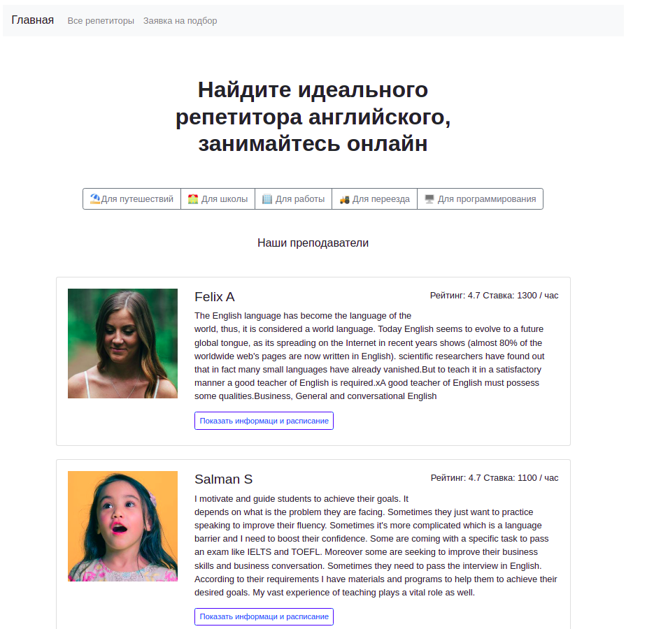
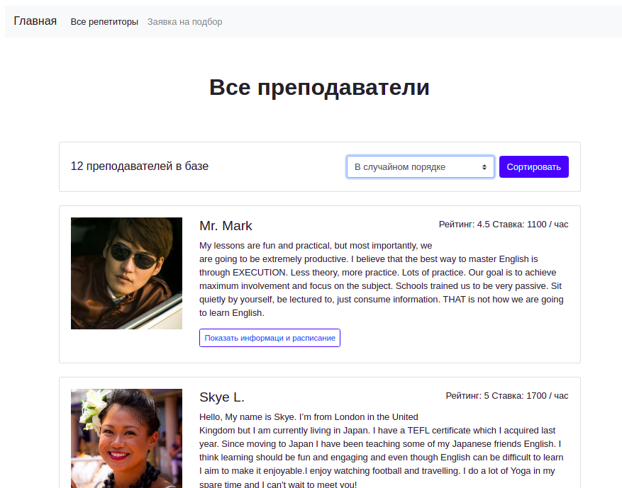
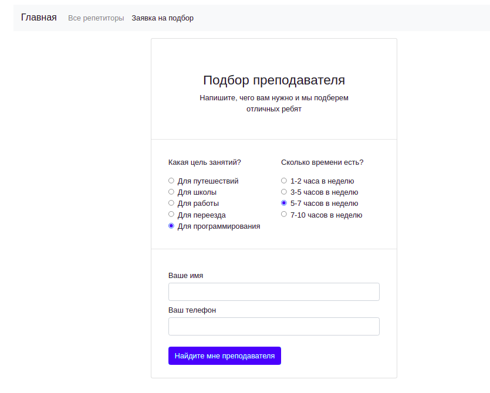

# flask_stepik_2

### Описание

Сайт, на котором пользователи могут найти себе репетитора.

### Технологии

Python      
Flask       

### Запуск проекта

- Склонируйте репозиторий:

```
git clone https://github.com/AlexeyPeresypkin/flask_stepik_2.git
```
Cоздайте и активируйте виртуальное окружение:

```
python -m venv venv
```
```
source venv/bin/activate 
```
Обновите pip и установите зависимости:
```
python -m pip install --upgrade pip
```
```
pip install -r requirements.txt
```
Запустите приложение
```
python app.py
```





